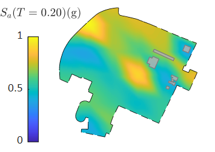
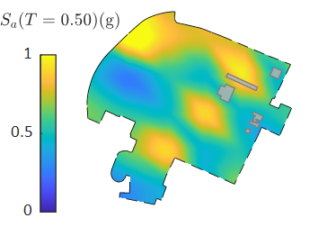
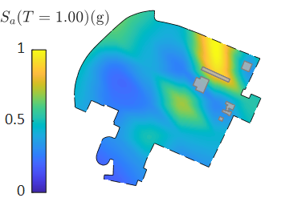

# 地震动强度空间分布随机场模拟

## 示例
以下为一次地震下某区域 $T=0.2,\ 0.5,\ 1.0\ \rm{s}$ 时谱加速度 $S_a$ 的分布：

## 使用

Examples文件夹中为例子，放入两个文件，名字为EQSource.txt，SiteFile.txt，依次震源信息和场地信息的文件名，然后直接运行IMSim.exe程序，即可进行模拟。

### 输入

1. **EQSource.txt** 每行依次为（每行内不同参数用空格分开）：
    - ifmedian - 0/1，是否输出中位值
    - M - 震级
    - N_sim - 次数
    - seed - int, 随机数种子
    - lon_0，lat_0 - 震中经纬度，°
    - W - 断层破裂面矩形的宽度，km，未知时可输入 999
    - length - 断裂面矩形的长度，km
    - RuptureNormal_x, RuptureNormal_y, RuptureNormal_z - 断裂面朝上的法线方向（向东为x,向北为y,向上为z）
    - lambda - 走滑角（°）- 上盘在破裂面内测量的滑移平均角度，与strike方向相同为0度，逆时针为正值
    - Fhw - 是否考虑上盘效应，0/1
    - Zhyp - 从海平面测量的震源深度，km， unknown, 未知时可输入 999
    - region - 研究的区域
     = 0 全球 (包括台湾)
     = 1 加州
     = 3 中国或者土耳其
     = 4 意大利
    - nPCs - IM相关性PCA方法模拟考虑的主成分阶数，推荐大于等于5
1. **SiteFile.txt** 每行为一个场地的数据，每一行空格分开依次为
    - ID - 场地点的编号
    - lon - 经度
    - lat - 纬度
    - elevation_km - 高程，km
    - period1 - 基本周期
    - Vs30_mpers - 剪切波速
    - Z25_km - 到2.5km/s剪切波速水平面的深度，km，（如果在加州或者日本， Z25_km未知, 可以输入999）

### 输出

1. **IM sim.txt** 每一行为一个场地的模拟，第一列为场地的ID，后面第二列到最后一列为该场地周期（**SiteFile.txt**中的period1）各次随机模拟的结果
2. **IM median with period 0.1.txt** 每一行为一个场地的模拟，第一列为场地的ID，第二列为Sa(T=0.1)的中值地震动强度
3. **IM sim with period 0.1.txt** 每一行为一个场地的模拟，第一列为场地的ID，后面第二列到最后一列为Sa(T=0.1)各次随机模拟的结果

## 参考文献

[1] K W Campbell, Y Bozorgnia. NGA-West2 Ground Motion Model for the Average Horizontal Components of PGA, PGV, and 5% Damped Linear Acceleration Response Spectra. Earthquake Spectra, 2014, 30(3): 1087-1115.

[2] N Jayaram, J W Baker. Correlation model for spatially distributed ground-motion intensities. Earthquake Engineering & Structural Dynamics, 2009, 38(15): 1687-1708.

[3] K Goda. Interevent Variability of Spatial Correlation of Peak Ground Motions and Response Spectra. Bulletin of the Seismological Society of America, 2011, 101(5): 2522-2531.

[4] M Markhvida, L Ceferino, J W Baker. Modeling spatially correlated spectral accelerations at multiple periods using principal component analysis and geostatistics. Earthquake Engineering & Structural Dynamics, 2018, 47(5): 1107-1123.

