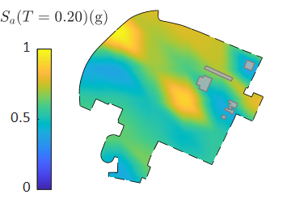
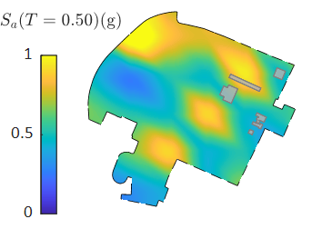
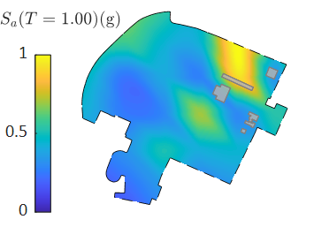

# Spatial Distribution Simulation of Seismic Intensity

[中文文档](./README_CN.md)

## Examples
Below are the spectral acceleration (Sa) distributions at T=0.2, 0.5, and 1.0s for a region under an earthquake:




## Usage

The Examples folder contains sample files. Place two files named `EQSource.txt` and `SiteFile.txt`, containing earthquake source information and site information respectively, and then run the `IMSim.exe` program to perform the simulation.

### Input

1. **EQSource.txt** Each line contains the following parameters (separated by spaces):
    - ifmedian - 0/1, whether to output median values
    - M - Magnitude
    - N_sim - Number of simulations
    - seed - int, random number seed
    - lon_0, lat_0 - Epicenter longitude and latitude, degrees
    - W - Width of the fault rupture plane rectangle, km, input 999 if unknown
    - length - Length of the fault rupture plane rectangle, km
    - RuptureNormal_x, RuptureNormal_y, RuptureNormal_z - Normal direction of fault plane (east is x, north is y, up is z)
    - lambda - Rake angle (°) - Average slip angle measured on the hanging wall within the rupture plane, 0 degrees aligned with strike direction, positive counterclockwise
    - Fhw - Whether to consider hanging wall effects, 0/1
    - Zhyp - Hypocenter depth measured from sea level, km, input 999 if unknown
    - region - Study region
     = 0 Global (including Taiwan)
     = 1 California
     = 3 China or Turkey
     = 4 Italy
    - nPCs - Number of principal components to consider in the IM correlation PCA method, recommended 5 or more
1. **SiteFile.txt** Each line represents data for one site, with the following parameters (separated by spaces):
    - ID - Site ID
    - lon - Longitude
    - lat - Latitude
    - elevation_km - Elevation, km
    - period1 - Fundamental period
    - Vs30_mpers - Shear wave velocity
    - Z25_km - Depth to the 2.5km/s shear wave velocity horizon, km (if in California or Japan and Z25_km is unknown, input 999)

### Output

1. **IM sim.txt** 
   Each line represents simulation results for one site. The first column is the site ID, and subsequent columns (from the second to the last) are the random simulation results for the site's period (period1 in `SiteFile.txt`)
2. **IM median with period 0.1.txt** 
   Each line represents simulation results for one site. The first column is the site ID, and the second column is the median seismic intensity for $Sa(T=0.1)$
3. **IM sim with period 0.1.txt** 
   Each line represents simulation results for one site. The first column is the site ID, and subsequent columns (from the second to the last) are the random simulation results for $Sa(T=0.1)$

## CMake Compilation
1. **Install CMake**: Download and install the appropriate version of CMake for your operating system from the [CMake website](https://cmake.org/download/).
2. **Install MinGW-w64**: For Windows systems, download from [MinGW-w64](https://github.com/niXman/mingw-builds-binaries/releases) (for Windows 11, this version can be used: `x86_64-14.2.0-release-win32-seh-ucrt-rt_v12-rev0.7z`). After installation, ensure that the MinGW-w64 `bin` directory is added to your system's `PATH` environment variable.
3. **Modify compiler directory in CMakePresets.json**:
    ```json
    {
        ...
        "configurePresets": [
            {
                "name": "Release",
                "displayName": "Release",
                "description": "Using compiler: C = F:\\mingw64\\bin\\gcc.exe, CXX = F:\\mingw64\\bin\\g++.exe",
                "generator": "MinGW Makefiles",
                "binaryDir": "${sourceDir}/build/${presetName}",
                "cacheVariables": {
                    "CMAKE_INSTALL_PREFIX": "${sourceDir}/out/install/${presetName}",
                    "CMAKE_C_COMPILER": "F:/mingw64/bin/gcc.exe",
                    "CMAKE_CXX_COMPILER": "F:/mingw64/bin/g++.exe",
                    "CMAKE_BUILD_TYPE": "Release"
                }
            }
        ]
    }
    ```
1. **Compile Release Version**: Create a new build directory in the project root and enter it, then use CMake to generate and compile the Release version build files.
    ```sh
    mkdir -p build && cd build
    cmake --preset Release -S ..
    cmake --build Release
    ```
2. **Run the Executable**: After compilation, you can find the generated executable in the `build` directory and run it.
    ```sh
    ./IMSim/IMSim.exe
    ```

## References

[1] K W Campbell, Y Bozorgnia. NGA-West2 Ground Motion Model for the Average Horizontal Components of PGA, PGV, and 5% Damped Linear Acceleration Response Spectra. Earthquake Spectra, 2014, 30(3): 1087-1115.

[2] N Jayaram, J W Baker. Correlation model for spatially distributed ground-motion intensities. Earthquake Engineering & Structural Dynamics, 2009, 38(15): 1687-1708.

[3] K Goda. Interevent Variability of Spatial Correlation of Peak Ground Motions and Response Spectra. Bulletin of the Seismological Society of America, 2011, 101(5): 2522-2531.

[4] M Markhvida, L Ceferino, J W Baker. Modeling spatially correlated spectral accelerations at multiple periods using principal component analysis and geostatistics. Earthquake Engineering & Structural Dynamics, 2018, 47(5): 1107-1123.
