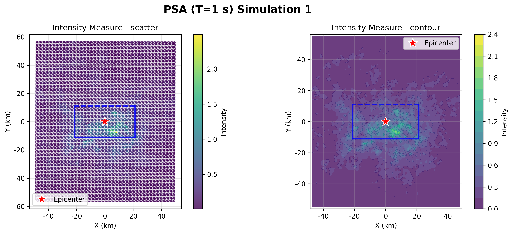
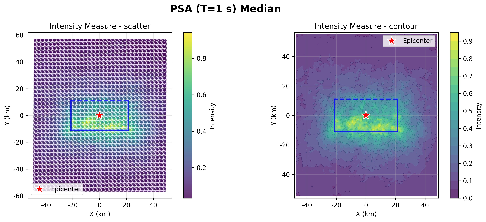

# Spatially Correlated Ground-Motion Intensity Simulation

[中文文档](https://github.com/youtian95/spatialim/blob/rust/README_CN.md)

This package provides a fast tool to simulate spatially correlated ground-motion intensity measures based on established ground-motion prediction equations (GMPEs) and spatial correlation models.

## Examples
The `python/examples` folder contains a magnitude-7 scenario. Below is one random simulation of Sa (T = 1 s); the rectangle shows the surface projection of the fault:

Median of 10 simulations for Sa (T = 1 s):


## Python Usage

1. Install the package:
   ```
   pip install spatialim
   ```
2. The `python/examples/demo.py` script demonstrates how to run the spatial ground-motion simulation end to end.

## References

1. K. W. Campbell, Y. Bozorgnia. NGA-West2 Ground Motion Model for the Average Horizontal Components of PGA, PGV, and 5% Damped Linear Acceleration Response Spectra. Earthquake Spectra, 2014, 30(3): 1087-1115.
2. N. Jayaram, J. W. Baker. Correlation model for spatially distributed ground-motion intensities. Earthquake Engineering & Structural Dynamics, 2009, 38(15): 1687-1708.
3. K. Goda. Interevent Variability of Spatial Correlation of Peak Ground Motions and Response Spectra. Bulletin of the Seismological Society of America, 2011, 101(5): 2522-2531.
4. M. Markhvida, L. Ceferino, J. W. Baker. Modeling spatially correlated spectral accelerations at multiple periods using principal component analysis and geostatistics. Earthquake Engineering & Structural Dynamics, 2018, 47(5): 1107-1123.

## Developer Notes

### Code Structure

Core logic lives in `src/core/`:

- `simulator.rs`: orchestrates GMPE evaluation and residual simulation
- Feature modules
  - `io.rs`: input/output handling
  - `geo.rs`: distance calculations and related helpers
  - `site.rs`: site definitions
  - `eq_source.rs`: earthquake source definitions
  - `utilities.rs`: common utility functions
- Core modules
  - `gmpe`: ground-motion prediction equations (currently CB14)
  - `b_res_sim.rs`: between-event residual simulation
  - `w_res_sim.rs`: within-event residual simulation

### Packaging for Python

1. Install `maturin`:
   ```
   pip install maturin
   ```
2. Update `Cargo.toml` with:
   ```toml
   [lib]
   name = "_spatialim"
   crate-type = ["cdylib", "rlib"]

   [dependencies]
   pyo3 = { version = "0.27.1", features = ["extension-module"] }
   ```
3. Add `pyproject.toml`:
   ```toml
   [build-system]
   requires = ["maturin>=1.0,<2.0"]
   build-backend = "maturin"

   [tool.maturin]
   python-source = "python"
   module-name = "spatialim._spatialim"
   exclude = ["**/*.pyd", "**/*.so", "**/*.dylib"]
   ```
   Other fields follow a standard `pyproject.toml`.
4. Create the `python` directory:
   ```
   python/
   ├── spatialim/
   │   ├── __init__.py
   │   ├── _spatialim.pyi  # type hints
   │   └── other modules
   └── setup.py
   ```
5. For local development, install into your active Python environment:
   ```
   maturin develop --release
   ```
6. Build distributable wheels:
   ```
   maturin build --release
   ```


